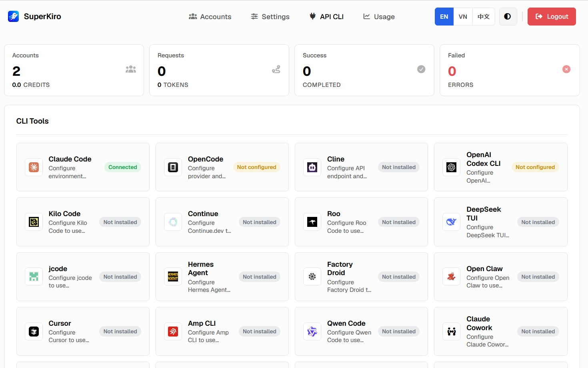

<p align="center">
  <a href="https://github.com/lenhanpham/SuperKiro">
    <picture>
      
    </picture>
  </a>
</p>

# SuperKiro
<div align="center">
  <a href="https://go.dev/">
    
  </a>
  <a href="https://www.docker.com/">
    
  </a>
  <a href="LICENSE">
    
  </a>
</div>
<div align="center">
  <p>Convert Kiro accounts to OpenAI / Anthropic compatible API service.</p>
</div>
<div align="center">
  <a href="README.md">English</a> | <a href="README_CN.md">中文</a> | <a href="README_VN.md">Tiếng Việt</a>
</div>
<div align="center">
  <p>If this project helps you, a Star would mean a lot.</p>
</div>

<p align="center">
  <a href="https://github.com/lenhanpham/SuperKiro">
    <picture>
      
    </picture>
  </a>
</p>

## Features

- **API compatibility** — Anthropic `/v1/messages`, OpenAI `/v1/chat/completions` & `/v1/responses`, streaming SSE
- **Multi-account pool** — round-robin load balancing, endpoint failover, combo fallback chains
- **12 auth methods** — AWS Builder ID, IAM Identity Center, SSO Token, Social Login, Kiro CLI import, Kiro SSO 3-step browser login, AWS SSO Cache, Kiro Local Cache, Credentials JSON, Kiro Web Cookie, API Key (ksk_), Refresh Token
- **Auto token refresh** — credentials stay valid without manual intervention
- **Prompt filters** — replace Claude Code CLI system prompts with compact backend version, strip env noise and boundary markers; custom regex rules (admin panel)
- **Endpoint config** — auto-select, Kiro, CodeWhisperer, or Amazon-Q endpoint with optional fallback
- **Per-account outbound proxy** — global or account-level SOCKS5 / HTTP proxy
- **Usage tracking** — per-account credits, tokens, request counts, overage alerts
- **Thinking mode** — configurable suffix trigger, output format (reasoning_content / thinking / think)
- **Web admin panel** — manage accounts, settings, i18n (EN / CN / VN)

## Note
Not all IDEs, CLI tools, and Agents are fully tested. Only Claude Code, OpenCode, and Codex are tested.

## Quick Start

### Docker Compose (Recommended)

```bash
git clone https://github.com/lenhanpham/SuperKiro.git
cd SuperKiro
mkdir -p data
docker-compose up -d
```

### Docker Run

```bash
docker run -d \
  --name superkiro \
  -p 8080:8080 \
  -e ADMIN_PASSWORD=your_secure_password \
  -v /path/to/data:/app/data \
  --restart unless-stopped \
  ghcr.io/lenhanpham/superkiro:latest
```

### Build from Source

```bash
git clone https://github.com/lenhanpham/SuperKiro.git
cd SuperKiro
go build -o superkiro .
./superkiro
```

### Deploy on Zeabur

The repo already includes a `Dockerfile`, so it builds and runs on Zeabur out of the box.

**Option 1: Dashboard (one-click)**

1. Fork this repo to your GitHub account.
2. In Zeabur, create a new service and choose **Deploy from GitHub**, then select your fork.
3. Zeabur auto-detects the `Dockerfile` and builds the image.
4. In the **Networking** tab, expose port `8080` and bind a domain.
5. In the **Variables** tab, set at least `ADMIN_PASSWORD` (admin panel password).
6. Mount a Volume at `/app/data` if you want accounts / config to survive redeploys.

**Option 2: CLI**

```bash
npm i -g zeabur
zeabur auth login
zeabur deploy
```

> Run the commands from the project root. The CLI writes `.zeabur/context.json` to remember the target project / service — it contains personal IDs, so don't commit it.

Once the service is up, open `https://<your-domain>/admin` to log in.

Config is auto-created at `data/config.json`. Mount `/app/data` for persistence. The default admin password is `changeme` — override it via the `ADMIN_PASSWORD` env var or change it in the admin panel before going to production.

## Usage

Open `http://localhost:8080/admin`, log in, add accounts, then call the API:

```bash
# Claude
curl http://localhost:8080/v1/messages \
  -H "Content-Type: application/json" \
  -H "anthropic-version: 2023-06-01" \
  -d '{"model":"claude-sonnet-4.5","max_tokens":1024,"messages":[{"role":"user","content":"Hello!"}]}'

# OpenAI / Chat
curl http://localhost:8080/v1/chat/completions \
  -H "Content-Type: application/json" \
  -H "Authorization: Bearer any" \
  -d '{"model":"gpt-4o","messages":[{"role":"user","content":"Hello!"}]}'

# OpenAI / Responses
curl http://localhost:8080/v1/responses \
  -H "Content-Type: application/json" \
  -H "Authorization: Bearer any" \
  -d '{"model":"claude-sonnet-4.5","input":"Hello!","max_output_tokens":1024}'
```

## Thinking Mode

Append a suffix (default `-thinking`) to the model name, e.g. `claude-sonnet-4.5-thinking`. Claude-compatible requests that include a top-level `thinking` config such as `{"type":"enabled","budget_tokens":2048}` or `{"type":"adaptive"}` also enable thinking mode automatically. Configure output format in the admin panel under Settings - Thinking Mode.

## Outbound Proxy

For users in restricted network regions, configure an outbound proxy in the admin panel under **Settings - Outbound Proxy Settings**. Supports SOCKS5 and HTTP proxies.

The setting takes effect immediately without restarting.

## Environment Variables

| Variable | Description | Default |
|----------|-------------|---------|
| `CONFIG_PATH` | Config file path | `data/config.json` |
| `ADMIN_PASSWORD` | Admin panel password (overrides config) | - |

## Contributing

Friendly discussion is welcome. If you run into issues, try asking Claude Code, Codex, or similar tools for help first — most problems can be solved that way. PRs are even better.

## Acknowledge 

SuperKiro is forked from Kiro-Go and developed based on [Kiro-Go](https://github.com/Quorinex/Kiro-Go) 

## Disclaimer

For educational and research purposes only. Not affiliated with Amazon, AWS, or Kiro. Users are responsible for complying with applicable terms of service and laws. Use at your own risk.

## License

[MIT](LICENSE)
